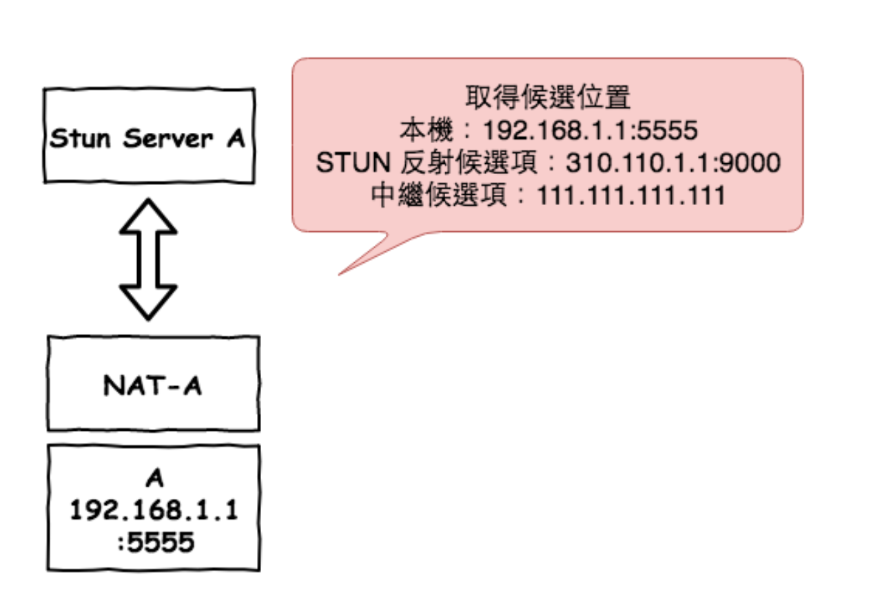
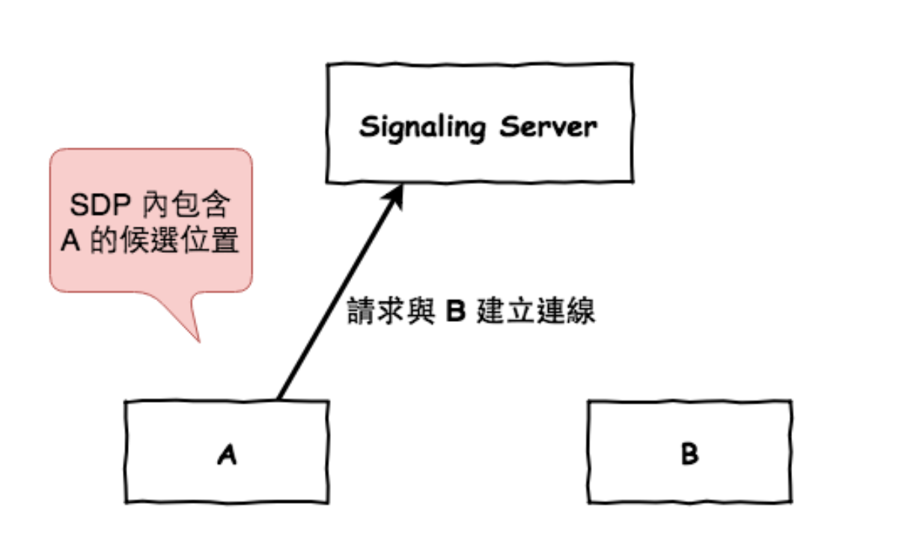
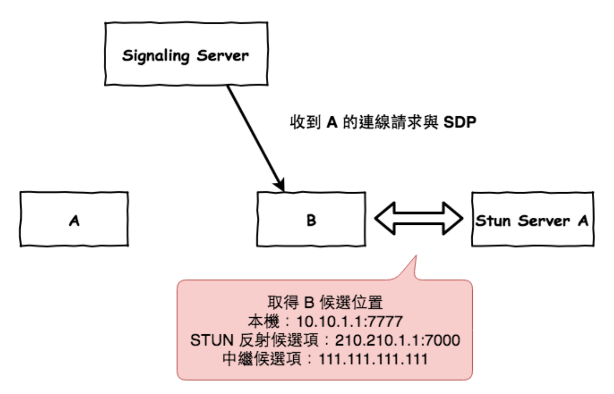
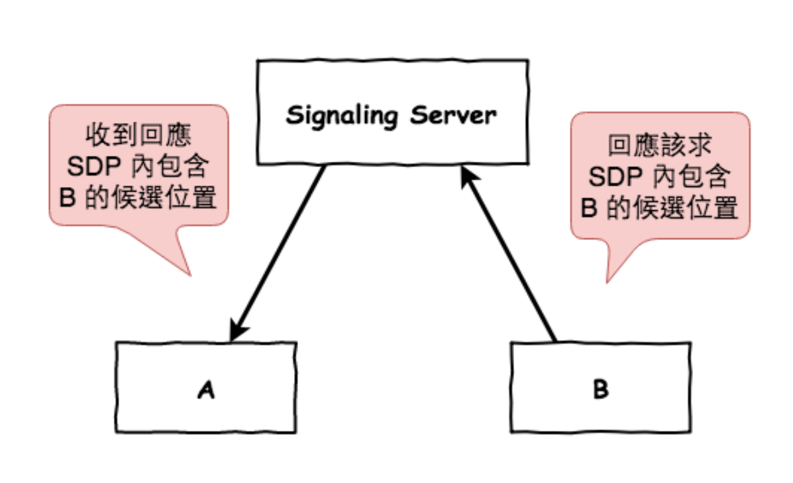
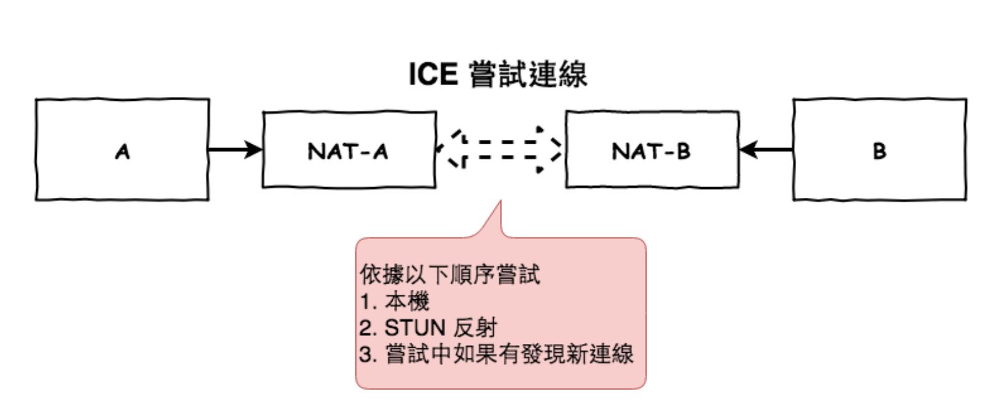
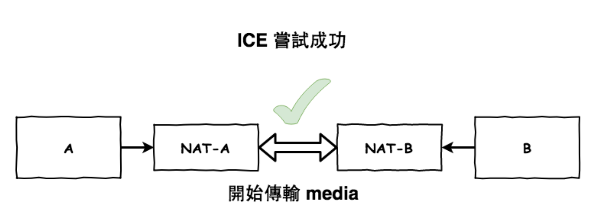
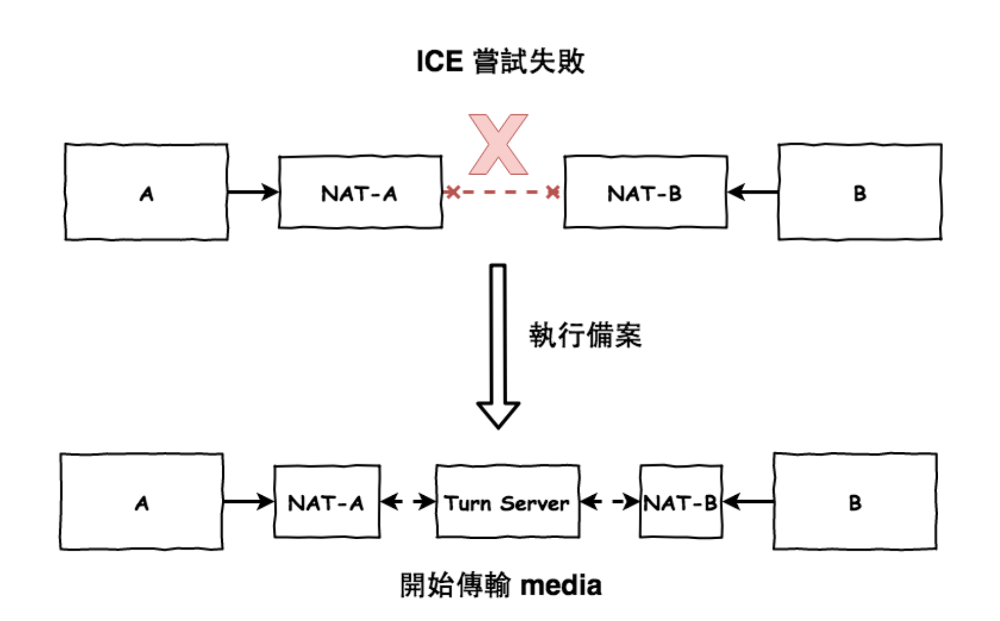

##
### 通訊
- NAT 通常指網路位址轉譯（Network Address Translation），這是一種網路技術，允許多個設備共用一個公用IP位址來連線到網際網路。它將內部私有IP位址轉換為公共IP位址，這有助於節省有限的IPv4位址並提供一層安全性。
- WebRTC 它主要使用一個名為ICE ( Interactive Connectivity Establishment ) 的框架來進行打洞，它內部整合了 STUN 與 TURN 協議，下面簡單的說明一下這兩個協議。
- STUN ( Session Traversal Utilities for NAT ) 中文為 NAT 對談穿透應用程式，它的最主要用處就是幫助在 NAT 內的用戶找到可以連到它的位置。
- TURN ( Traversal Using Relay NAT )，它也是一種穿透 NAT 的一樣協議，不過它是使用中繼的方式來進行，通常都是 STUN 的候選位置都無法連線時，才會使用它。
- TURN 伺服器
大多數 WebRTC 應用程式都需要伺服器，才能在對等端之間轉送流量，因為客戶端之間通常無法使用直接的通訊端 (除非位於相同的本機網路)。解決這個問題的常見方法是使用 TURN 伺服器。這個詞代表「透過 NAT 使用中繼」，是用於轉送網路流量的通訊協定。
目前網路上有幾種 TURN 伺服器選項，包括自架應用程式 (例如開放原始碼 COTURN 專案) 和雲端提供的服務。
當您在線上取得 TURN 伺服器後，只需要正確的 RTCConfiguration 即可讓用戶端應用程式使用。以下程式碼片段說明 RTCPeerConnection 的設定範例，其中 TURN 伺服器的電腦名稱為 my-turn-server.mycompany.com，並在 19403 連接埠上執行。設定物件也支援 username 和 credential 屬性，可確保對伺服器的存取權。連線至 TURN 伺服器時，必須使用這些值。
```
const iceConfiguration = {
    iceServers: [
        {
            urls: 'turn:my-turn-server.mycompany.com:19403',
            username: 'optional-username',
            credential: 'auth-token'
        }
    ]
}

const peerConnection = new RTCPeerConnection(iceConfiguration);
```

- SDP(Session Description Protocol) 是一份具有特殊約定格式的純文本描述文檔（類似 JSON / XML），其中包含了 WebRTC 建立連接所需的 ICE 伺服器資訊、音視訊編碼資訊、加密演算法等，以便於在資料傳遞時兩端都能看懂對方的資料，而開發者可以使用 WebSocket 等傳輸協議將其發送到信令服務器。要注意的是這些內容只是描述資料的樣子，而不是資料本身。
```
SDP 通常包含以下內容:

各端所支援的影音編解碼器
編解碼所設定的參數
所使用的傳輸協議
ICE連接候選項等
```
```
範例如下：
v=0
o=jdoe 2890844526 2890842807 IN IP4 10.47.16.5
s=SDP Seminar
i=A Seminar on the session description protocol
u=http://www.example.com/seminars/sdp.pdf
e=j.doe@example.com (Jane Doe)
c=IN IP4 224.2.17.12/127
t=2873397496 2873404696
a=recvonly
m=audio 49170 RTP/AVP 0
m=video 51372 RTP/AVP 99
a=rtpmap:99 h263-1998/90000

說明：
o=jdoe 2890844526 2890842807 IN IP4 10.47.16.5
此會話由用戶 jdoe 發起，位於 IPv4 地址 10.47.16.5。

s=SDP Seminar
會話的名字是 SDP Seminar

有兩組 media stream
m=audio 49170 RTP/AVP 0
m=video 51372 RTP/AVP 99

a=rtpmap:99 h263-1998/90000
包含一個屬性， 將 RTP/AVP payload type 99 mapping 為 h263
```
- 手機使用 4G 完全可以建立 WebRTC 連線，只是大多數情況會走 TURN relay，而非純 P2P








