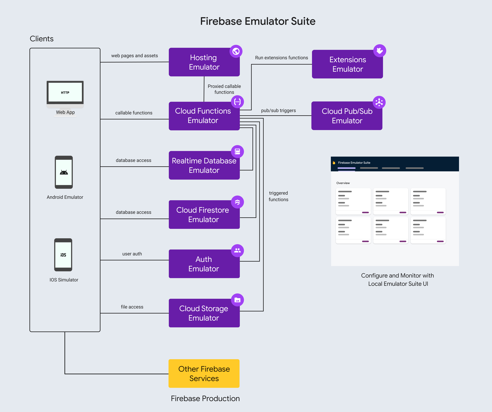

# Firebase
## install firebase CLI
```
download: https://firebase.google.com/docs/cli?hl=zh-tw#windows-standalone-binary
execute: firebase-tools-instant-win.exe
CLI: firebase login
CLI: firebase projects:list
```

## install flutterfire CLI
```
dart pub global activate flutterfire_cli
```

## 使用firebase
```
1. cd to flutter project directory
2. 執行 flutterfire configure (會在firebase建立專案. 產生 lib/firebase_options.dart. 相關birebase gradle安裝)
3. flutter pub add firebase_core
4. flutterfire configure
```

## 初始化firebase
```
import 'package:firebase_core/firebase_core.dart';
import 'firebase_options.dart';

WidgetsFlutterBinding.ensureInitialized();
await Firebase.initializeApp(
  options: DefaultFirebaseOptions.currentPlatform,
);
runApp(const MyApp());
```

## 相關firebase plugin

### Cloud Message
* firebase 設定 project
```
[Android]
https://console.firebase.google.com/project/cck-test/messaging/onboarding?hl=zh-tw
1. download google-services.json file (has a privite key)
2. about android app config
```

* flutter 程式
```
flutter pub add firebase_messaging
// You may set the permission requests to "provisional" which allows the user to choose what type
// of notifications they would like to receive once the user receives a notification.
final notificationSettings = await FirebaseMessaging.instance.requestPermission(provisional: true);

// For apple platforms, make sure the APNS token is available before making any FCM plugin API calls
final apnsToken = await FirebaseMessaging.instance.getAPNSToken();
if (apnsToken != null) {
 // APNS token is available, make FCM plugin API requests...
}

//use in web
final fcmToken = await FirebaseMessaging.instance.getToken(vapidKey: "BKagOny0KF_2pCJQ3m....moL0ewzQ8rZu");

FirebaseMessaging.instance.onTokenRefresh
    .listen((fcmToken) {
      // TODO: If necessary send token to application server.

      // Note: This callback is fired at each app startup and whenever a new
      // token is generated.
    })
    .onError((err) {
      // Error getting token.
    });

[防止自動初始化]
-iOS
Info.plist: FirebaseMessagingAutoInitEnabled = NO
-Android
AndroidManifest.xml
<meta-data
    android:name="firebase_messaging_auto_init_enabled"
    android:value="false" />
<meta-data
    android:name="firebase_analytics_collection_enabled"
    android:value="false" />

[重新啟用執行階段的 FCM 自動初始化功能]
await FirebaseMessaging.instance.setAutoInitEnabled(true);
```
* 訊息處理
```
firebase-messaging 套件提供兩種處理這類互動的方式：

getInitialMessage(): 如果應用程式是從終止狀態開啟，這個方法會傳回包含 RemoteMessage 的 Future。RemoteMessage 一經使用就會移除。
onMessageOpenedApp：應用程式從背景狀態開啟時，會發布 RemoteMessage 的 Stream。

class Application extends StatefulWidget {
  @override
  State createState() => _Application();
}

class _Application extends State {
  // In this example, suppose that all messages contain a data field with the key 'type'.
  Future setupInteractedMessage() async {
    // Get any messages which caused the application to open from
    // a terminated state.
    RemoteMessage? initialMessage =
        await FirebaseMessaging.instance.getInitialMessage();

    // If the message also contains a data property with a "type" of "chat",
    // navigate to a chat screen
    if (initialMessage != null) {
      _handleMessage(initialMessage);
    }

    // Also handle any interaction when the app is in the background using a
    // Stream listener
    FirebaseMessaging.onMessageOpenedApp.listen(_handleMessage);
  }

  void _handleMessage(RemoteMessage message) {
    if (message.data['type'] == 'chat') {
      Navigator.pushNamed(context, '/chat',
        arguments: ChatArguments(message),
      );
    }
  }

  @override
  void initState() {
    super.initState();

    // Run code required to handle interacted messages in an async function
    // as initState() must not be async
    setupInteractedMessage();
  }

  @override
  Widget build(BuildContext context) {
    return Text("...");
  }
}
```

## firebase service emulator
